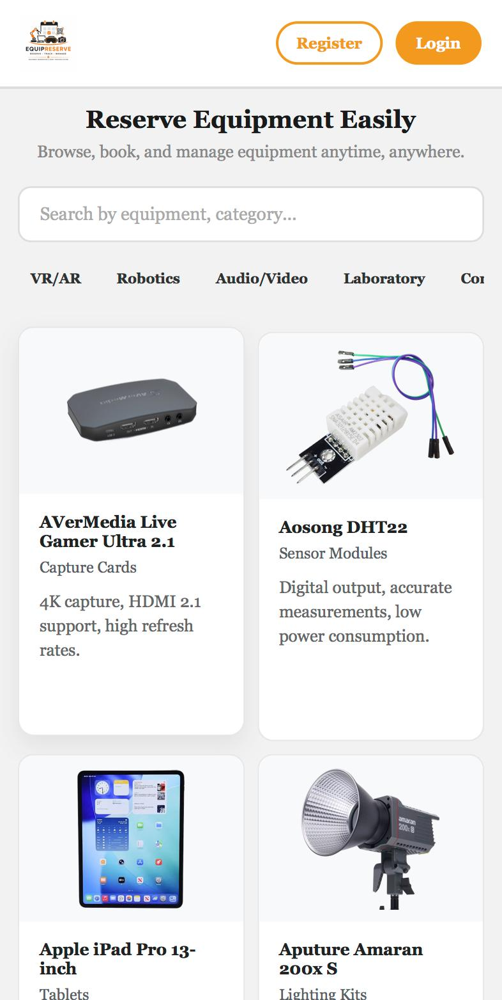
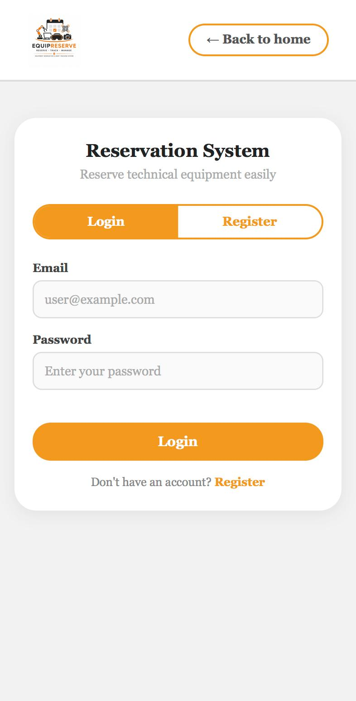
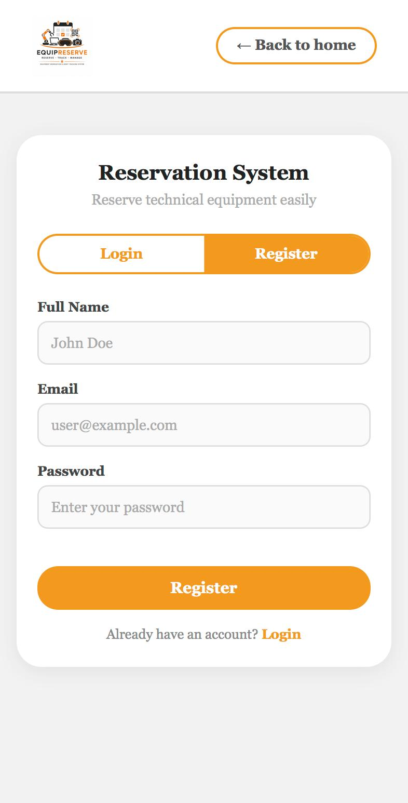
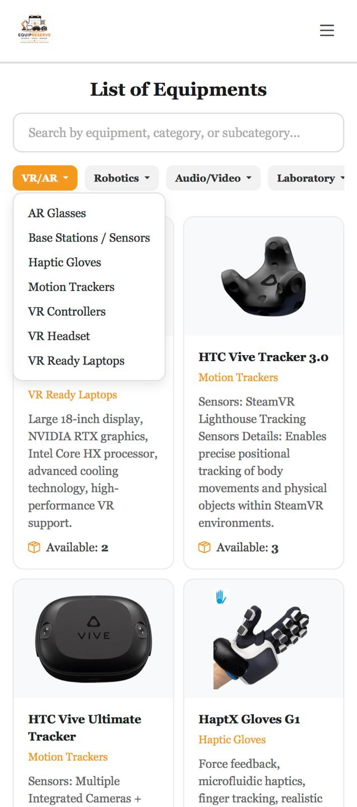
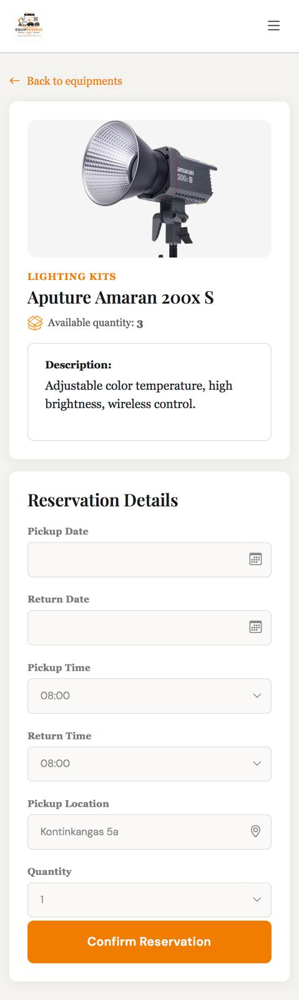
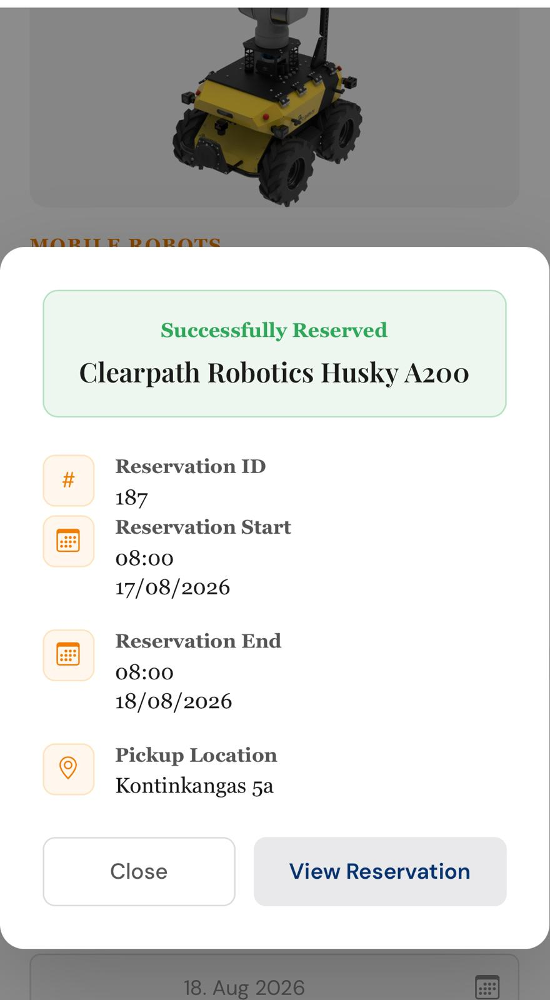
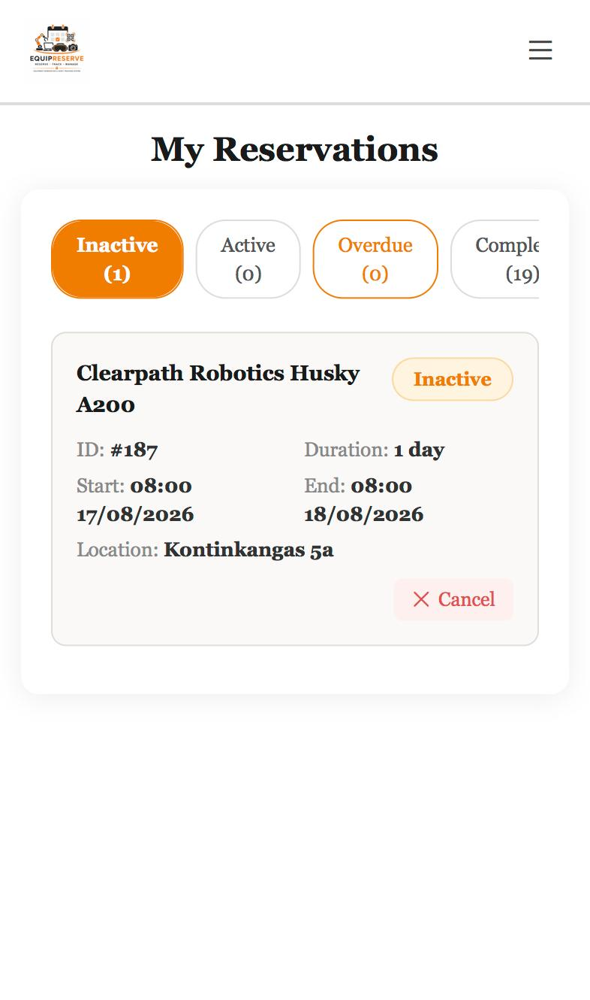
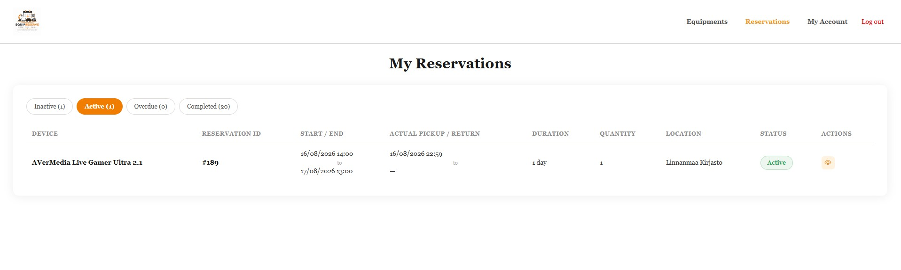
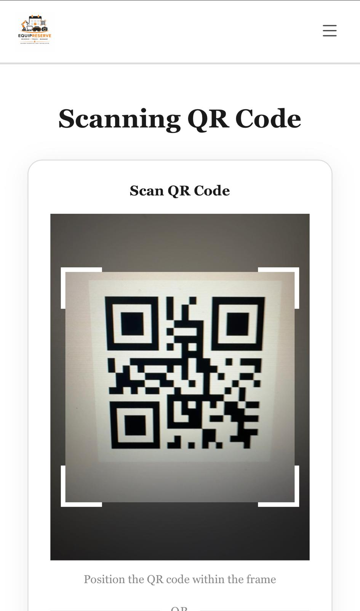

## Project Description
EquipReserve is a modular reservation and asset tracking system designed for institutions that manage shared technical equipment — VR headsets, AR glasses, motion trackers, robotics, lab devices, and more.

It allows students, staff, and admins to:
- Browse available equipment and make time-based reservations
- Check equipment in and out via QR code scanning
- Track the full lifecycle of every physical unit — from booking to return
- Receive email notifications for reservation confirmations, reminders, and overdue alerts
- Manage equipment condition, status, and audit logs through an admin dashboard

## Live Demo
https://reservation-faevbvdgeybqg4fv.swedencentral-01.azurewebsites.net/

## Team
- Janne Kumpuoja (Supervisor)
- Diem Tran (Student)
- Thi Dinh (Student)
- Upeksha Eshani (Student)
- Ruvindra Nimshani (Student)

## Technology Stack

| Layer | Technology |
|---|---|
| **Frontend** | HTML, CSS, JavaScript |
| **Backend** | Node.js + Express.js |
| **Database** | PostgreSQL |
| **Authentication** | JSON Web Token (jsonwebtoken), bcrypt |
| **QR Scanning** | qrcode, html5-qrcode |
| **Email** | Nodemailer |

## Features

| Feature | Description |
|---|---|
| **Role-based access** | Three roles: `student`, `staff`, `admin` — each with different booking permissions |
| **Equipment catalog** | Browse equipment by category, status, and availability |
| **Time-based reservations** | Book specific equipment types for defined time slots |
| **Unit assignment** | A specific physical unit is assigned to a reservation at checkout |
| **QR code check-in/out** | Scan QR code on physical unit to trigger checkout or return |
| **Admin dashboard** | Full overview of reservations, equipment status, and users |
| **Email notifications** | Confirmation, reminder, and overdue alerts via email |
| **Condition tracking** | Record equipment condition at check-out and return |
| **Audit logging** | Every action on every unit is recorded with before/after state |
| **Booking policies** | Status transitions enforced by reservation lifecycle rules |

## Pages

### Shared

| Landing Page | Login / Register |
|---|---|
|  |   |
| Public entry point with an overview of the platform. | Sign in or create an account; role (`student`, `staff`, `admin`) determines which views are accessible afterward. |

### Student / Staff View

| Equipment List | Equipment Details |
|---|---|
|  |  |
| Browse available equipment by category, subcategory, and real-time availability. | Pick date, time, and pickup location; quantity updates automatically based on that location's stock. |

| Reserved Confirmation |
|---|
|  |
| Confirms a successful booking and shows the reservation ID(s), pickup window, and location. |

| My Reservation | Scanning QR Code |
|---|---|
|    |  |
| Track all reservations across Inactive, Active, Overdue, and Completed tabs, with actual pickup/return timestamps.(actual timestamps available for desktop view only) | Scan the physical unit's QR code to trigger checkout or return. |

| Reservation Actions (Pickup) | Reservation Actions (Return) |
|---|---|
| _screenshot here_ | _screenshot here_ |
| Confirms equipment pickup after a successful QR scan within the booked time window. | Confirms equipment return and submits it for admin approval. |

| My Account | Change Password |
|---|---|
| _screenshot here_ | _screenshot here_ |
| View and manage account details. | Update account password securely. |

## Environment Variables

Create a `.env` file inside `/backend`:

**Do NOT commit `.env` to GitHub.**

## Running Locally

**1. Clone the repo**
```bash
git clone https://github.com/meras-oamk/equipment-reservation-system.git
```

**2. Install dependencies**
```bash
npm install
```

**3. Set up the database**

This project uses [Neon](https://neon.tech)

**4. Start the server**
```bash
npm run dev
```

**5. Open in browser**

[http://localhost:3001](http://localhost:3000)

## Database Schema
The database consists of five core tables and supporting enums.


## Project Structure

```
equipment-reservation-system/
│
├── backend/                         # Node.js + Express API server
│   ├── helpers/                     # Shared utility modules
│   │   ├── auth.js                  # JWT authentication middleware
│   │   ├── db.js                    # PostgreSQL connection pool
│   │   ├── hash.js                  # Password hashing (bcrypt)
│   │   └── role.js                  # Role-based access guard middleware
│   │
│   ├── routes/                      # Express route handlers
│   │   ├── equipment.js             # Equipment types & units CRUD
│   │   ├── log.js                   # Equipment audit log endpoints
│   │   ├── overdue_job.js           # Scheduled job — marks overdue reservations
│   │   ├── reservations.js          # Reservation lifecycle endpoints
│   │   └── users.js                 # User management endpoints
│   │
│   ├── index.js                     # Express app entry point & route mounting
│   ├── package.json                 # Backend dependencies & scripts
│   └── package-lock.json            # Locked dependency tree
│
├── database/                        # Database layer
│   └── meras.sql                    # Full PostgreSQL schema (tables, enums, constraints)
│
├── documents/                       # Project documentation assets
│   └── ER-diagram.png               # Entity Relationship Diagram
│
├── frontend/                        # Plain HTML / CSS / JS client
│   ├── assets/                      # Static assets
│   │   └── logo.png                 # ResEquip brand logo
│   │
│   ├── css/                         # Stylesheets
│   │   └── style.css                # Global styles
│   │
│   ├── html/                        # Page templates
│   │   ├── admin/                   # Admin-only pages (dashboard, manage equipment, users)
│   │   ├── user/                    # Student & staff pages (catalog, my reservations)
│   │   ├── index.html                # Landing page
│   │   └── loginOrRegister.html     # Login / register page
│   │
│   └── js/                          # Client-side JavaScript
│       ├── admin/                   # Admin page scripts
│       ├── user/                    # User page scripts
│       ├── auth.js                  # Token storage & auth state management
│       └── loginOrRegister.js       # Login / register form logic
│   
├── .gitignore                       # Git ignored files (node_modules, .env, etc.)
└── README.md                        # Project documentation (this file)
```

## Pages

| Admin | User |
|---|---|
| Landing Page | Landing Page |
| Login | Login / Signup |
| Dashboard | Equipment List |
| Reservations | Equipment Details |
| Equipment Management | Reserved Confirmation |
| Add Equipment | Reservation Details |
| Configuration | My Reservation |
| Add Categories | Scanning QR Code |
| Manage Users | Reservation Actions (Pickup) |
| Logs | Reservation Actions (Return) |
| Booking Policies | My Account |
| Change Password | Change Password |

## Course

TVT Kesäprojektit-Summer projects 2026

Oulu Universit of Applied Sciences (OAMK)

Sprint period: 13.5 - 15.8.2026


