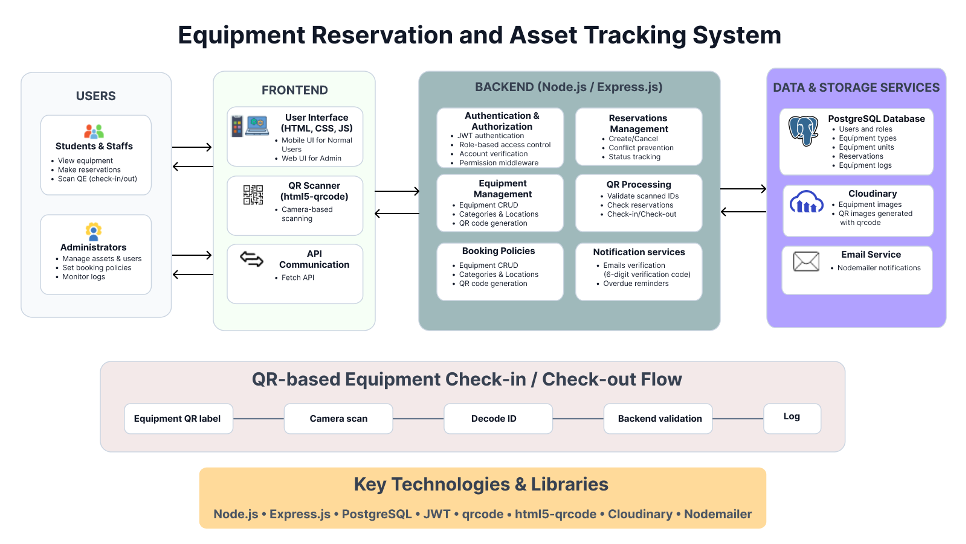
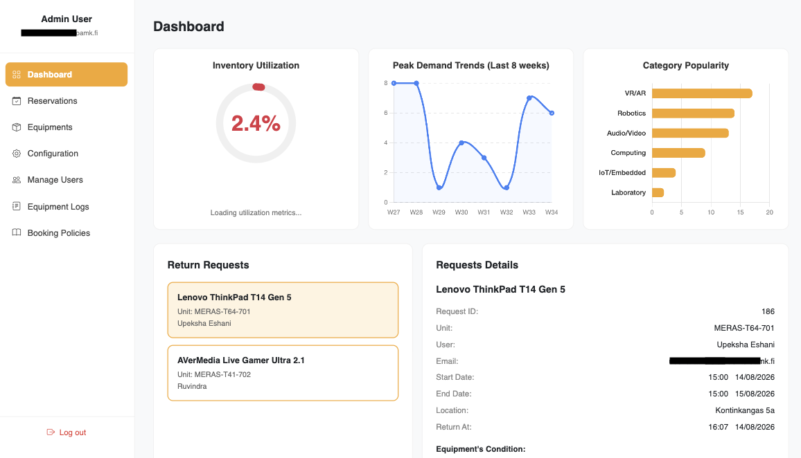
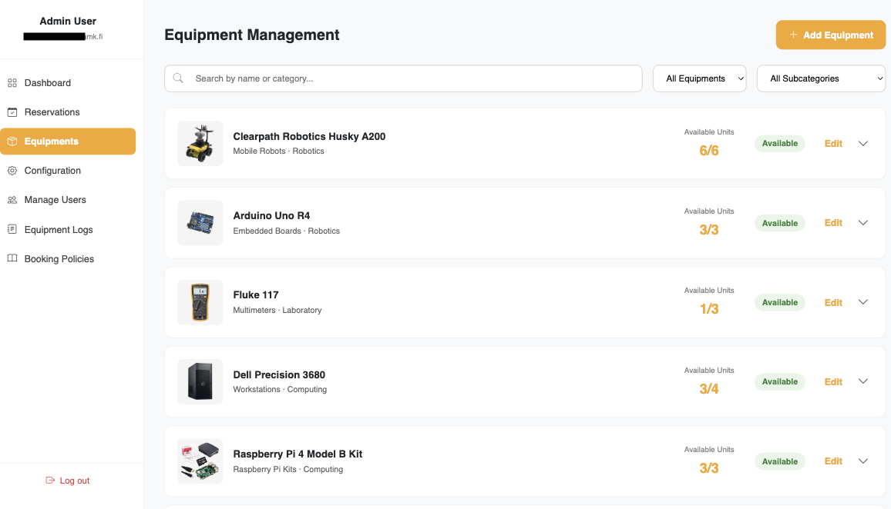

## Project Description
EquipReserve is a modular reservation and asset tracking system designed for institutions that manage shared technical equipment.

It allows students, staff, and admins to:
- Browse available equipment and make time-based reservations
- Check equipment in and out via QR code scanning
- Track the full lifecycle of every physical unit — from booking to return
- Receive email notifications for return reminders, and overdue alerts
- Manage equipment condition, status, and audit logs through admin dashboard

## Team
- Diem Tran (Student)
- Thi Dinh (Student)
- Upeksha Eshani (Student)
- Ruvindra Nimshani (Student)

## Table of Contents
-   [Features](#features)
-   [Technologies](#technology-stack)
-   [Architecture](#architecture)
-   [Interface](#system-interfaces)
-   [Setup and Installation](#setup)
-   [Database Design](#database-design)
-   [Project Structure](#project-structure)

 ## Key Features

### Booking & Equipment Management
* **Time-Based Reservations:** Book specific equipment categories for defined, conflict-free time slots.
* **Unit Assignment:** Automatically assign a unit to a reservation at checkout.
* **Equipment Catalog:** Browse and filter inventory by category.
* **QR Code Check-In/Out:** Scan physical QR codes on equipment units to trigger checkout or return workflows.

### Admin & Operations
* **Role-Based Access Control (RBAC):** Distinct workflows and permissions for `student`, `staff`, and `admin` roles.
* **Admin Dashboard:** Providing a complete overview of reservations, equipment health, and user accounts.
* **Condition Tracking:** Log and monitor equipment condition during both check-out and return to identify damages early.

### Automation & Reliability
* **Audit Logging:** Every system action on every physical unit is recorded with a before-and-after state snapshot for accountability.
* **Lifecycle Rules:** Automated booking policies that strictly enforce valid status transitions.
* **Automated Notifications:** Sends emails for booking confirmations, return reminders, and overdue alerts.

## Technology Stack

| Layer | Technology |
|---|---|
| **Frontend** | HTML, CSS, JavaScript |
| **Backend** | Node.js + Express.js |
| **Database** | PostgreSQL |
| **Authentication** | JSON Web Token (jsonwebtoken), bcrypt |
| **QR Scanning** | qrcode, html5-qrcode |
| **Email** | Nodemailer |


## Architecture



## System Interfaces

### [View the website](https://reservation-faevbvdgeybqg4fv.swedencentral-01.azurewebsites.net/index.html)

### Student / Staff View
<video controls src="frontend/Assets/meras_user.mp4" title="Title"></video>

### Admin View





## Setup
Follow the instructions below to run the web application locally.

### Installation
**1. Clone the repo**
```bash
$ git clone https://github.com/meras-oamk/equipment-reservation-system.git
```

**2. Install dependencies**
```bash
# Install the dependencies for the backend
$ cd backend
$ npm install
```

**3. Set up the database**

This project uses [Neon](https://neon.tech)

Copy `/database/meras.sql` to create tables.

**4. Cloudinary Setup**

Sign up on [Cloudinary](https://cloudinary.com/) to create an account. Once registered, you can find your API key, API secret, and cloud name in your account settings.

**5. Environment variables**

Create `/backend/.env`

Add the following environment variables:
```bash
# PORT to run backend on
PORT=3001
# Connection URL to PostgreSQL database
DATABASE_URL=YOUR_POSTGRES_URL
# Secret key to sign tokens (random string)
JWT_SECRET=YOUR_SECRET_STRING
# Email service configuration
EMAIL_USER=YOUR_EMAIL
EMAIL_PASS=YOUR_PASS
# Cloudinary configuration
CLOUDINARY_API_KEY=API_KEY
CLOUDINARY_API_SECRET=API_SECRET
CLOUDINARY_CLOUD_NAME=CLOUD_NAME
```

**6. Start the server**
```bash
$ npm run dev
```

## Database Design
The database consists of five core tables and supporting enums.


## Project Structure

```
equipment-reservation-system/
│
├── backend/                         # Node.js + Express API server
│   ├── helpers/                     # Shared utility modules
│   │   ├── auth.js                  # JWT authentication middleware
│   │   ├── db.js                    # PostgreSQL connection pool
│   │   ├── hash.js                  # Password hashing (bcrypt)
│   │   └── role.js                  # Role-based access guard middleware
│   │
│   ├── routes/                      # Express route handlers
│   │   ├── equipment.js             # Equipment types & units CRUD
│   │   ├── log.js                   # Equipment audit log endpoints
│   │   ├── overdue_job.js           # Scheduled job — marks overdue reservations
│   │   ├── reservations.js          # Reservation lifecycle endpoints
│   │   └── users.js                 # User management endpoints
│   │
│   ├── index.js                     # Express app entry point & route mounting
│   ├── package.json                 # Backend dependencies & scripts
│   └── package-lock.json            # Locked dependency tree
│
├── database/                        # Database layer
│   └── meras.sql                    # Full PostgreSQL schema (tables, enums, constraints)
│
├── documents/                       # Project documentation assets
│   └── ER-diagram.png               # Entity Relationship Diagram
│
├── frontend/                        # Plain HTML / CSS / JS client
│   ├── assets/                      # Static assets
│   │   └── logo.png                 # ResEquip brand logo
│   │
│   ├── css/                         # Stylesheets
│   │   └── style.css                # Global styles
│   │
│   ├── html/                        # Page templates
│   │   ├── admin/                   # Admin-only pages (dashboard, manage equipment, users)
│   │   ├── user/                    # Student & staff pages (catalog, my reservations)
│   │   ├── index.html                # Landing page
│   │   └── loginOrRegister.html     # Login / register page
│   │
│   └── js/                          # Client-side JavaScript
│       ├── admin/                   # Admin page scripts
│       ├── user/                    # User page scripts
│       ├── auth.js                  # Token storage & auth state management
│       └── loginOrRegister.js       # Login / register form logic
│   
├── .gitignore                       # Git ignored files (node_modules, .env, etc.)
└── README.md                        # Project documentation (this file)
```

## Course

TVT Kesäprojektit-Summer projects 2026

Oulu Universit of Applied Sciences (OAMK)

Sprint period: 13.5 - 17.8.2026


